# Genisys Imu

Genisys คือโมดูล Imu 9DoF ผลิตโดย Anman ที่สามารถให้ค่าของ Orientaion ออกมาโดยใช้ Digital Motion Processor (DMP) ของตัวชิปเป็นของ TDK InvenSense ICM-20948

| ข้อมูลเซนเซอร์   | รายละเอียด |
| :-----------: | :-----------: |
| IMU Chip  | ICM-20948  |
| MCU Chip  | STM32F411  |
| Hardware Interface  | USB port และ TTL serial port |
| Data Output | Accelerate/Angular velocity/Mannetic field/Quaternion |
| Angular accuracy | X,Y Axis 0.05° (static) / 0.1° (dynamic) |
| Accelerate accuracy | 0.02g |
| Gyro accuracy | 0.06°/s |
| Data frequent | ~170Hz (IMU data) ~60Hz(Magnetic field) |


ข้อมูลที่ส่งออกมาจะมี:	
* Orientation, Accelerometer และ Gyroscope (sensor_msgs/Imu) ~170Hz: `/imu/data`
* Magnetometer (sensor_msgs/MagneticField) ~60Hz: `/imu/mag`

## วิธีการ build แพ็กเกจ genisys_imu

1) clone the repository to your catkin's workspace src folder and add udev rules

    ```
    $ cd ~/catkin_ws/src
    $ git clone https://github.com/AnmanTechnology/genisys_imu.git
    $ cd genisys_imu/
    $ sudo cp 99-genisys-imu.rules /etc/udev/rules.d/
    $ sudo udevadm control --reload-rules
    $ sudo udevadm trigger
	$ cd ~/catkin_ws/
	$ catkin build __or__ catkin_make
    ```
    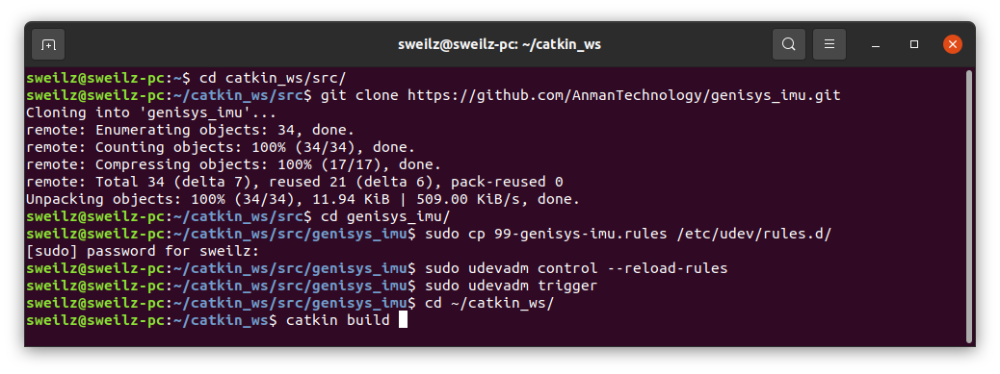
    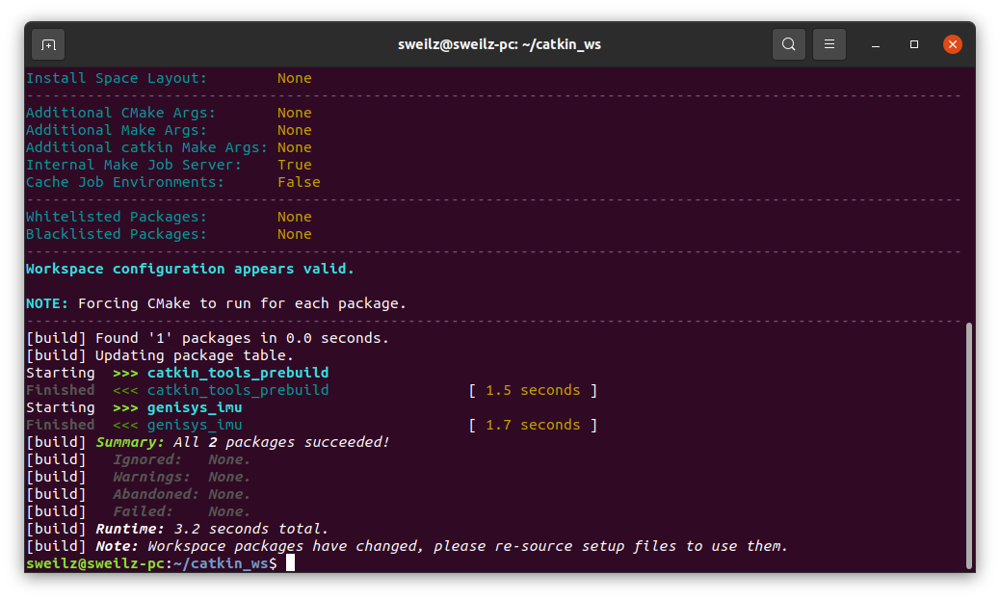
	เมื่อสำเร็จแล้วไม่เจอ Error

## วิธีการใช้งานบอร์ด Genisys imu กับ ROS

1) เชื่อมต่อบอร์ด Genisys imu กับคอมพิวเตอร์ผ่านสาย micro USB
    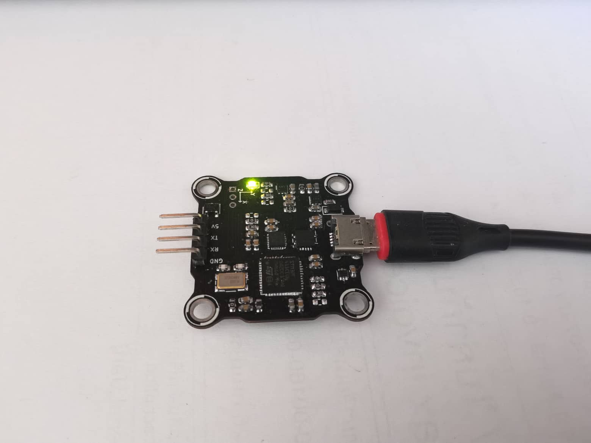
    เมื่อเสียบแล้วจะมีไฟสถานะสีเหลืองขึ้น

2) เช็คว่าคอมพิวเตอร์มองเห็นพอร์ต USB รึยังใช้คำสั่ง
    ```
    $ ls /dev/tty*
    ```
    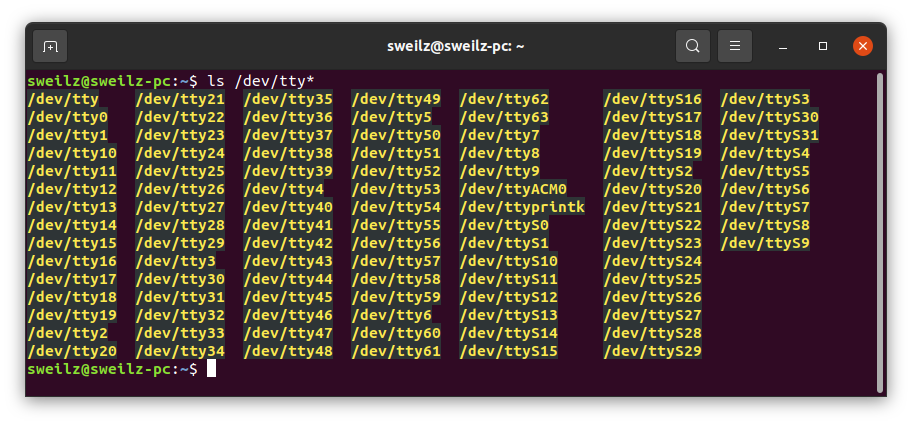
    จะเห็นว่ามีพอร์ตชื่อ `/dev/ttyACM0` ขึ้นมา

3) จากนั้นเปิด terminal ขึ้นมาแล้วใช้คำสั่ง
    ```
    $ roslaunch genisys_imu bringup.launch
    ```
    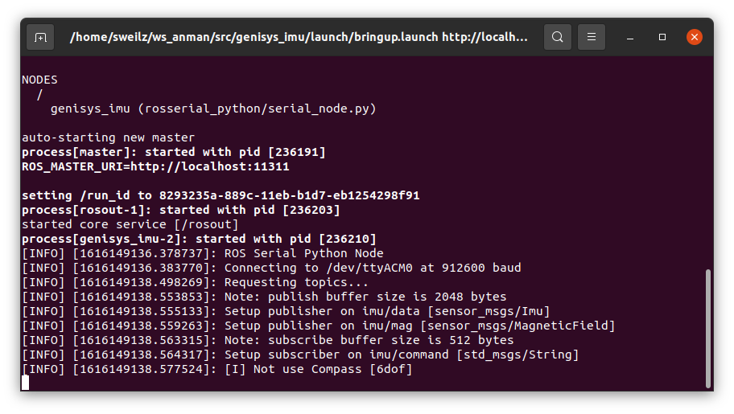
    หากต้องการกำหนด port เป็น /dev/Imu (ปกติเป็น /dev/ttyACM0)
    ```
    $ roslaunch genisys_imu bringup.launch port:=/dev/Imu
    ```
    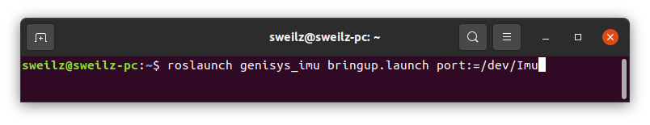

4) ทดสอบอ่านค่าจาก topic
    สำหรับบอร์ด Genisys เมื่อรันแล้วจะมี topic ออกมาอยู่ 3 ตัวคือ
    * /imu/data เป็นค่าของ Orientation, Accel, Gyro ชนิด sensor_msg/Imu
    * /imu/mag เป็นค่าของ Magnetic field ชนิด sensor_msg/MagneticField
    * /imu/command เป็น topic ใช้สำหรับรีเซ็ท Imu
    ```
    $ rostopic list
    ```
    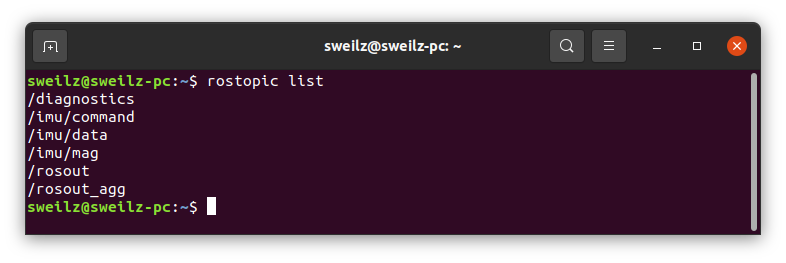

    อ่านค่าจาก `/imu/data` ซึ่งมีความถี่ประมาณ 170Hz
    ```
    $ rostopic echo /imu/data
    ```
    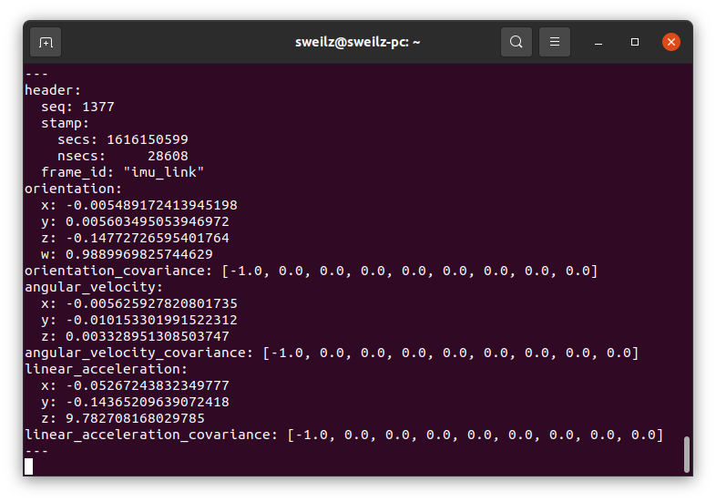
    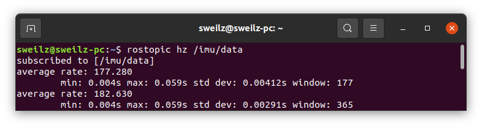
    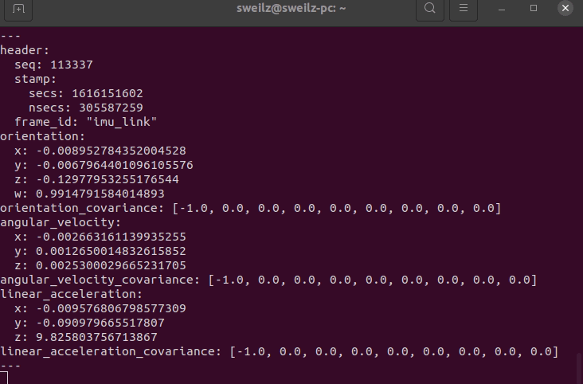

    อ่านค่าจาก `/imu/mag` ซึ่งมีความถี่ประมาณ 60Hz
    ```
    $ rostopic echo /imu/mag
    ```
    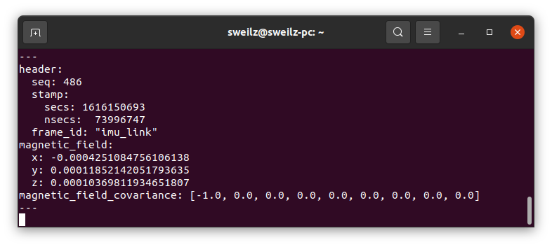
    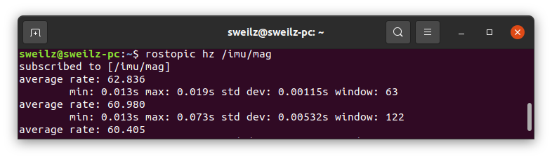

5) ทดสอบแสดงผลใน RViz
    ```
    $ roslaunch genisys_imu display.launch
    ```
    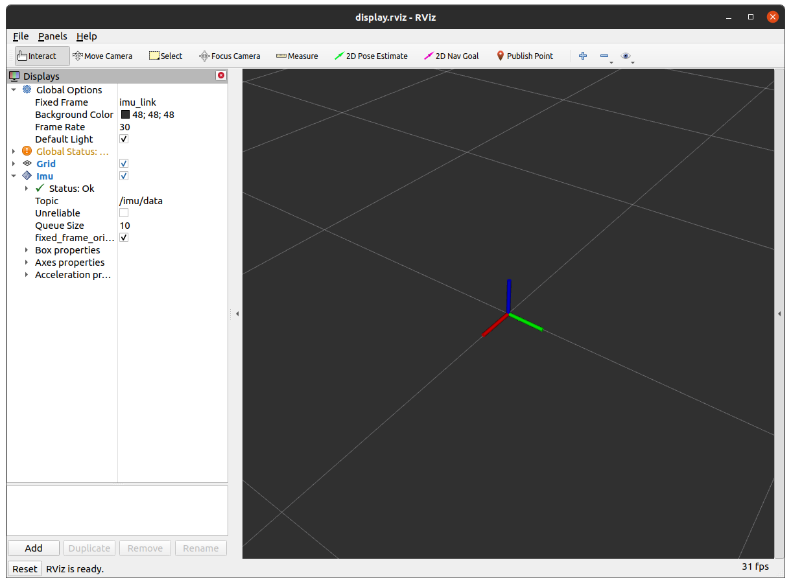
    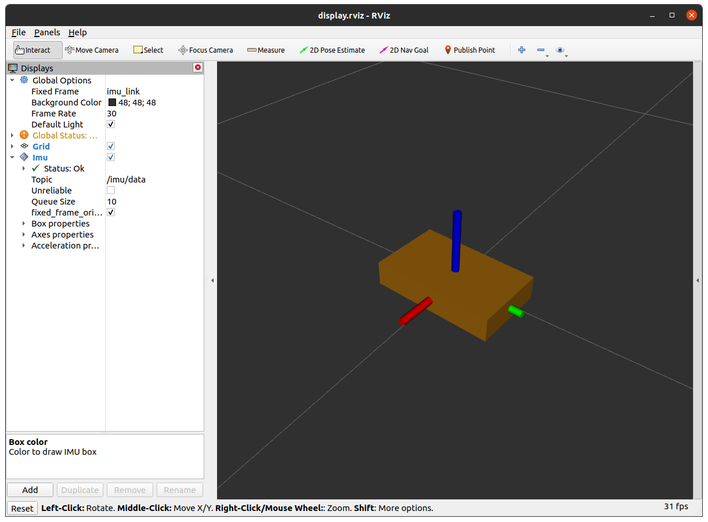
    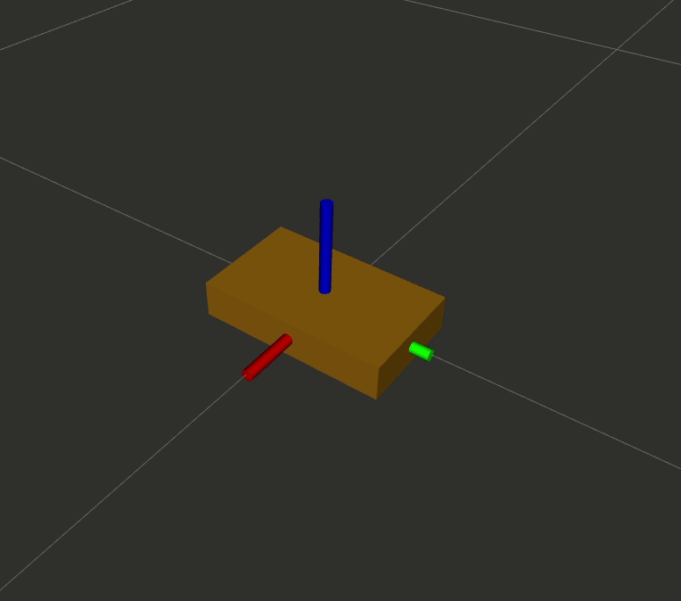
## วิธีการอ่านข้อมูลจากช่อง UART หากไม่ได้ใช้งานกับ ROS

บอร์ด Genisys imu เมื่อไม่ได้ใช้ช่อง USB จะทำการสตรีมค่าต่างๆออกมาทางช่อง UART ด้วยความถี่ประมาณ 150Hz Baudrate: 115200

ข้อมูลที่ส่งออกมาเป็น Structure ประกอบไปด้วย

* quaternion 6dof [x, y, z, w]
* quaternion 9dof [x, y, z, w]
* angular velocity [x, y, z]
* linear acceleration [x, y, z]
* magnetic field [x, y, z]

### ตัวอย่างโค้ดที่อ่านด้วยโปรแกรม Arduino

```cpp
#include <Arduino.h>
#include <SoftwareSerial.h>
#define SERIAL_RX_BUFFER_SIZE 256

struct quaternion_t
{
  float x;
  float y;
  float z;
  float w;
};

struct vector3d_t
{
  float x;
  float y;
  float z;
};

struct imu_struct_t
{
  quaternion_t orientation_6;
  quaternion_t orientation_9;
  vector3d_t angular_velocity;
  vector3d_t linear_acceleration;
  vector3d_t magnetic_field;
};

imu_struct_t imu_msg;

SoftwareSerial imu(2, 3);

void setup()
{
  Serial.begin(115200);
  imu.begin(115200);
}

void loop()
{
  static uint32_t blink_time = 0;
  uint32_t curr_time = millis();

  /* Display loop in 20Hz */
  if (curr_time - blink_time >= 50)
  {
    blink_time = curr_time;

    /* Display the results (quaternion 6dof)*/
    Serial.print(imu_msg.orientation_6.x, 3);
    Serial.print(", ");
    Serial.print(imu_msg.orientation_6.y, 3);
    Serial.print(", ");
    Serial.print(imu_msg.orientation_6.z, 3);
    Serial.print(", ");
    Serial.print(imu_msg.orientation_6.w, 3);
    Serial.print(" | ");
    /* Display the results (quaternion 9dof)*/
    Serial.print(imu_msg.orientation_9.x, 3);
    Serial.print(", ");
    Serial.print(imu_msg.orientation_9.y, 3);
    Serial.print(", ");
    Serial.print(imu_msg.orientation_9.z, 3);
    Serial.print(", ");
    Serial.print(imu_msg.orientation_9.w, 3);
    Serial.print(" | ");
    /* Display the results (linear acceleration is measured in m/s^2) */
    Serial.print(imu_msg.linear_acceleration.x, 3);
    Serial.print(", ");
    Serial.print(imu_msg.linear_acceleration.y, 3);
    Serial.print(", ");
    Serial.print(imu_msg.linear_acceleration.z, 3);
    Serial.print(" | ");
    /* Display the results (angular velocity is measured in radian/s) */
    Serial.print(imu_msg.angular_velocity.x, 3);
    Serial.print(", ");
    Serial.print(imu_msg.angular_velocity.y, 3);
    Serial.print(", ");
    Serial.print(imu_msg.angular_velocity.z, 3);
    Serial.print(" | ");

    /* Display the results (magnetic field is measured in Tesla) */
    Serial.print(imu_msg.magnetic_field.x, 6);
    Serial.print(", ");
    Serial.print(imu_msg.magnetic_field.y, 6);
    Serial.print(", ");
    Serial.print(imu_msg.magnetic_field.z, 6);
    Serial.print(" | ");
    Serial.println();
  }

  if (imu.available() > 0)
  {
    static uint8_t _state_protocol = 0;
    uint8_t size;
    uint8_t ret[150];
    uint8_t ch = imu.read();
    switch (_state_protocol)
    {
    case 0:
      if (ch == 0xFF)
        _state_protocol = 1;
      break;
    case 1:
      if (ch == 0xFF)
        _state_protocol = 2;
      break;
    case 2:
      if (ch == 0xFF)
        _state_protocol = 3;
      break;
    case 3:
      if (ch == 0xFD)
      {
        size = imu.readBytes(&ret[0], 68);
        if (size == 68)
        {
          memcpy(&imu_msg, &ret[0], size);
        }
        _state_protocol = 0;
      }
      break;

    default:
      break;
    }
  }
}
```
